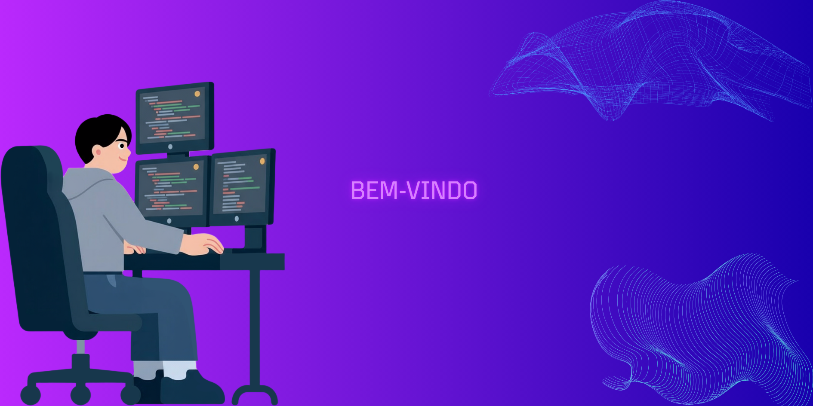

  

# 👨🏻‍💻 Lucas Assis

**`Desenvolvedor em aprimoração em Beck-end e Front-end`**

Me chamo Lucas José Assis Franca, tenho 19 anos e sou Niterói, Rio de Janeiro. Concluí o ensino médio no colégio La Salle Abel. Atualmente, estou cursando Sistemas de Informação na Unilasalle. Sou apaixonado por tecnologia e compartilho meu conhecimento através de projetos.

## 🌐 Meus Contatos

---

### 🤖 Linguagens e Tecnologias

 
 

## 🌐 Idiomas

### 📊 Estatísticas

